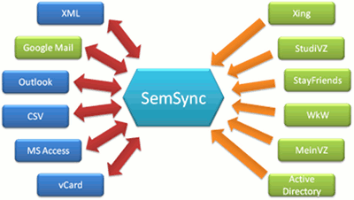

**New Version needs .Net 4.0 - you will not be able to start the program without installing .Net 4.0!**

**Project Description**
SemSync is a project for synchronizing entities (currently contacts) between different object stores. It contains connectors to Microsoft Outlook, MS Exchange, XML, vCard, CSV, Google Contacts, Microsoft Access, Wer-Kennt-Wen, StayFriends, StudiVZ, Xing and other social networks.

**[How I do work with it](How-I-do-work-with-it)**

Please contact me in case of problems - mostly I can solve issues in 1-2 days, if I get the information what did fail in detail

**Please read the [release:47308](release_47308) in order to get the free Visual Studio tools you need to work with this project.**
See the [http://svenerikmatzen.wordpress.com/](http://svenerikmatzen.wordpress.com/) for news about the current source code base (the current development basis).

The project does currently improve from day to day. If you find it useful, you might tell me about your ideas and needs. Otherwise, keep surfing on other projects ;-)
If you vote on an issue I will prioritize the implementation - you can also mail me for more ideas.

SemSync is a project for synchronizing entities between different object stores. If you trust in my capabilities to write nice programs and want to try synchronizing without installing Visual Studio, then download the file “Sync Outlook with Xing” – this is a compiled version with a very simple user interface and only supports synchronizing from Xing to Outlook. You also might give “Synchronization Manager” a try, which is a little bit more complex, but allows you to use any of the connectors below and saves the "log on" credentials in a save way.

The current implementation is done for synchronizing contact entities and comes with “connectors” (the full list of connectors is only available in the “Synchronization Manager” at the tab “Downloads”):
* Xing contacts using web scraping technology
* File system
	* One big xml file
	* Many small xml files
	* vCards (can read/write images from file system)
	* CSV (tab separated for Microsoft Excel - can map/exclude fields)
* Microsoft Outlook 2007
* Microsoft Outlook 2003 (also compatible with Microsoft Outlook 2007)
* Active Directory with filter (the sample filters by a group membership)
* Wer-Kennt-Wen (using web scraping technology - if you want to support development of this connector: add me as a friend)
* StudiVZ and MeinVZ (using web scraping technology - not tested very well, but working with my contacts - if you want to support development of this connector: add me as a friend)
* StayFriends.de (using web scraping technology)
* Facebook (via API - you need a developer key to use it - if you want to support development of this connector: add me as a friend)
* a simple WCF online store
* a writer connector for some statistics (XML can be loaded by Microsoft Excel)
* Google Mail (called GMail in some countries) via Google Contacts API ([http://code.google.com/intl/de-DE/apis/gdata/](http://code.google.com/intl/de-DE/apis/gdata/)) - this is currently under development
* Microsoft Access database with a very simple data mapping (read/write only to a single table supported at the moment)
* Microsoft Exchange 2007/2010 connector using the Exchange Web Services (EWS) Managed API
* Oracle CRM on Demand - this connector has been developed by [SDX AG](http://www.sdx-ag.de/) (the company I work for), so it's NOT licensed under LGPL, but I have the permission to publish the source code and grant you the right for using it.

When downloading the complete source code (you can download the latest version from the "Source Code" tab on the right side of the page), you might get some "Project type not supported" messages from Visual Studio. This is because I’ve added [WiX](WiX)-, [DocProject](DocProject)-, [Silverlight](Silverlight)-, [WCF](WCF)- and [Azure](Azure) projects to the solution. You can simply exclude the projects not supported by your development environment or download the SDKs to support these project types (they are all available for free).

Version 2009-12-10 has been tested by Softpedia:

Version 2009-12-10 got a 5-Star-Rating from SoftSea.com:
